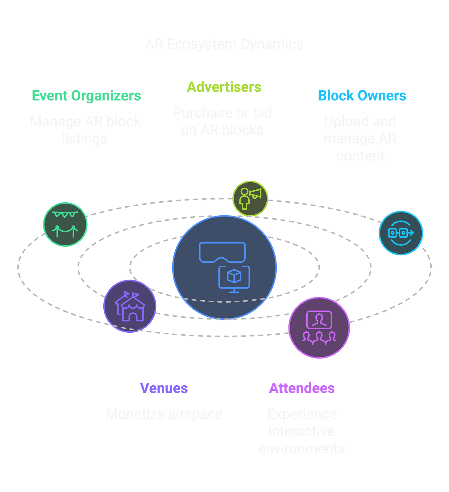
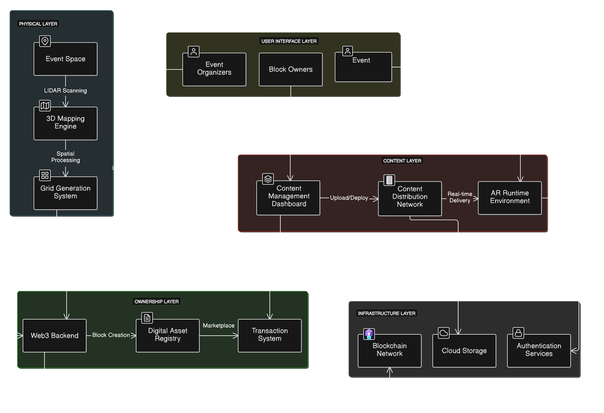
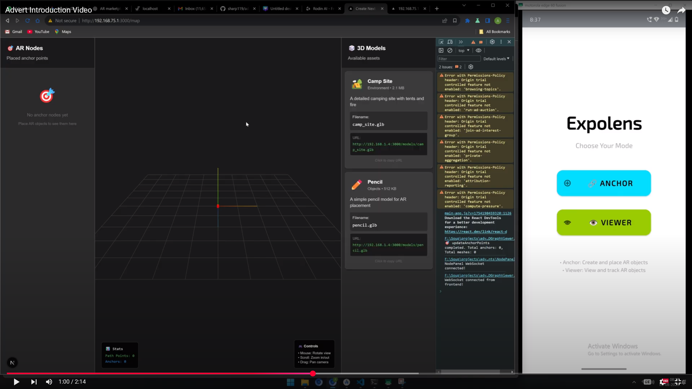
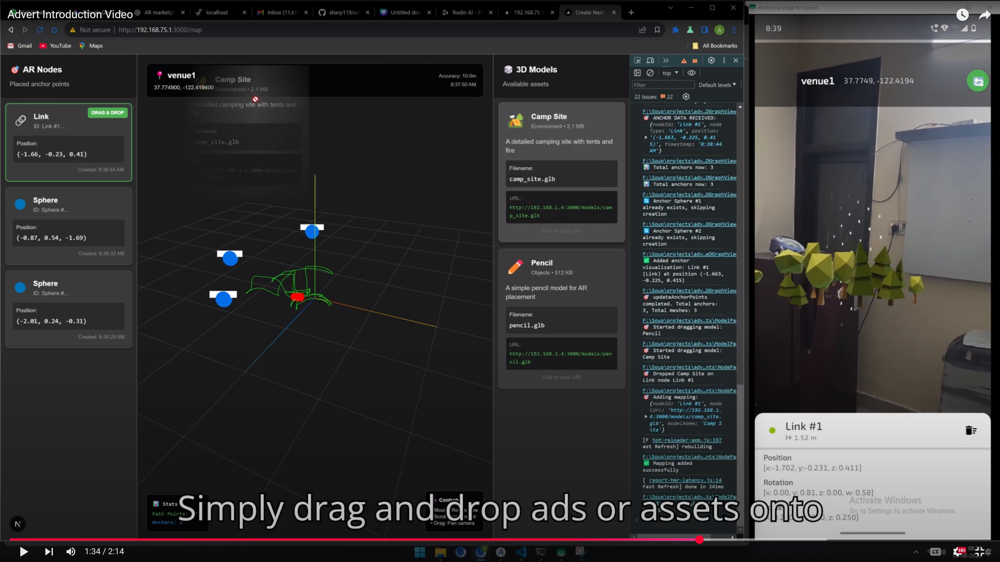
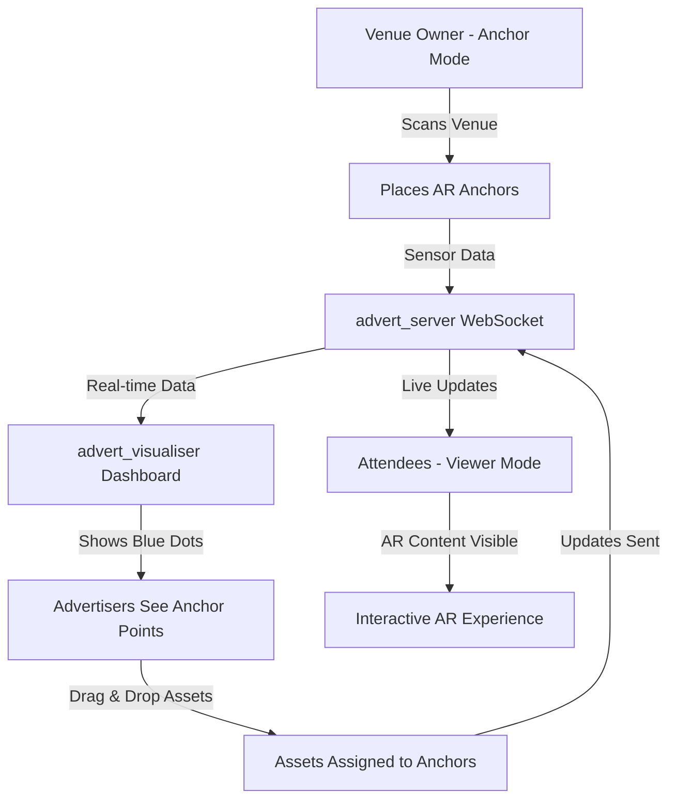
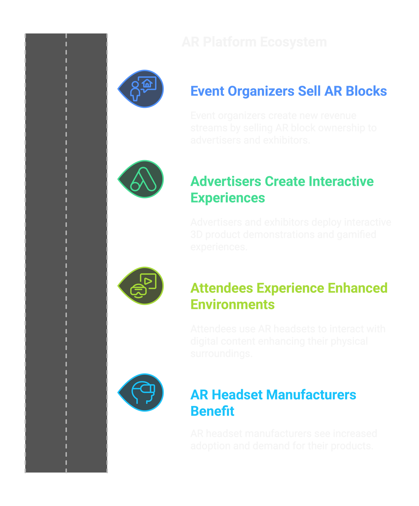

# 🌌 ADVERT  
**Transform Empty Air into Digital Real Estate**  

ADVERT is an **AR Space Segmentation & Monetization Platform** that bridges the physical and digital worlds.  
We transform empty airspace inside venues (stadiums, arenas, conference halls, etc.) into **ownable digital blocks** that can be monetized, traded, and filled with immersive AR content.  

---

## 🎯 Vision  

<div style="display: flex; gap: 20px; align-items: center;">

<div style="flex: 1;">

ADVERT transforms empty venue airspace into ownable AR blocks, enabling organizers to monetize spaces and advertisers to deliver interactive, engaging experiences.  

This is not just Augmented Reality.  
This is the future of **physical space ownership & engagement**.

</div>

<div style="flex: 1;">


*Experience the future - AR content floating in stadium airspace*

</div>

</div>

---

## 🚨 Problem  

- **Fragmentation** – Current AR experiences are isolated, not shared or standardized.  
- **Lack of Monetization** – No platform exists for organizers to divide, manage, and sell AR real estate mapped to physical locations.  
- **High Costs & Complexity** – AR advertising today requires huge budgets and technical expertise, limiting adoption to large companies.  

---

## ✅ Our Solution  

<div style="display: flex; gap: 30px; align-items: flex-start;">

<div style="flex: 0.45;">



*The ADVERT ecosystem connecting all stakeholders*

</div>

<div style="flex: 0.48; margin-left: 20px;">

ADVERT creates a **shared, standardized AR infrastructure** by:  

1. **Scanning & Mapping Venues** – Using **LiDAR, ARCore, ARKit, SLAM**, and spatial computing to digitize venues.  
2. **Segmenting AR Airspace** – Dividing physical spaces into purchasable, ownable "blocks" of air.  
3. **Web3 Ownership** – Minting these blocks on blockchain (ICP integration), enabling true ownership and trading.  
4. **Deploying AR Content** – Owners can instantly place interactive AR ads, experiences, or digital assets in their purchased blocks.  
5. **Marketplace** – A unified platform where organizers, brands, and creators interact seamlessly.

</div>

</div>

---

## 🏗️ Repository Structure

This repository contains three main components that work together to create the ADVERT ecosystem:

```
advert_ar_client_app/
├── 📱 expolens/                    # Android AR App (Kotlin)
│   ├── app/
│   │   ├── src/main/java/fr/smarquis/ar_toolbox/
│   │   │   ├── ArActivity.kt       # Main AR activity
│   │   │   ├── WebSocketManager.kt # Sensor data transmission
│   │   │   └── ...
│   │   └── build.gradle.kts        # Android build configuration
│   └── README.md
├── 🖥️ advert_server/              # Node.js WebSocket Server
│   ├── server.js                  # Main server handling sensor data
│   └── package.json
├── 🎨 advert_visualiser/          # Next.js Dashboard & Visualizer
│   ├── src/
│   │   ├── components/
│   │   │   ├── ThreeDGraphViewer.js   # 3D visualization
│   │   │   ├── ModelPanel.js          # Asset management
│   │   │   └── NodePanel.js           # Anchor controls
│   │   └── app/
│   │       ├── map/page.js            # Main dashboard
│   │       └── api/                   # API endpoints
│   └── package.json
└── assets/                        # Demo images and videos
    ├── anchors.png
    ├── dashboard_app.png
    └── promo_stadium.png
```

---

## 🛠️ Technology Stack  

<div style="display: flex; gap: 20px; align-items: center;">

<div style="flex: 1;">

- **Mobile App**: Kotlin (Android-first), ARCore for AR functionality  
- **AR Frameworks**:  
  - Google ARCore (Android spatial tracking)  
  - LiDAR (for depth sensing & segmentation)  
  - SLAM (Simultaneous Localization and Mapping)  
  - WebSocket real-time communication  
- **Backend**: Node.js WebSocket server for sensor data processing  
- **Dashboard**: Next.js + React + Three.js for 3D visualization  
- **Future**: Unity cross-platform support, ICP Blockchain integration

</div>

<div style="flex: 1;">



*Complete ADVERT system architecture showing all layers from physical to infrastructure*

</div>

</div>

---

## 📋 Setup Instructions

### Prerequisites
- **Android Studio** (latest version)
- **Node.js** (v16 or higher)
- **Android device** with ARCore support OR **Android Emulator**
- **Windows/Mac/Linux** development machine

### 1. 🖥️ Backend Server Setup (`advert_server`)

The server captures sensor data from the mobile app and broadcasts it to connected dashboards.

```bash
# Navigate to server directory
cd advert_server

# Install dependencies
npm install

# Start the WebSocket server
node server.js
```

**Server will start on:**
- WebSocket: `ws://localhost:8080` (for mobile app)
- HTTP API: `http://localhost:3001` (for dashboard)

### 2. 🎨 Dashboard Setup (`advert_visualiser`)

The dashboard provides real-time 3D visualization and drag-&-drop asset management.

```bash
# Navigate to visualizer directory
cd advert_visualiser

# Install dependencies
npm install

# Start the development server
npm run dev
```

**Dashboard will be available at:** `http://localhost:3000`

### 3. 📱 Android App Setup (`expolens`)

The AR app handles venue scanning, anchor placement, and real-time sensor data transmission.

#### Step 1: Open in Android Studio
```bash
# Open the expolens folder in Android Studio
# File > Open > Select 'expolens' folder
```

#### Step 2: Configure Network IP Address
**IMPORTANT:** Update the local IP address in the app to match your development machine.

**For Android Emulator:**
- WebSocket URL: `ws://10.0.2.2:8080`

**For Physical Android Device:**
- Find your computer's local IP address:
  - **Windows:** `ipconfig` (look for IPv4 Address)
  - **Mac/Linux:** `ifconfig` or `ip addr show`
- Update WebSocket URL to: `ws://YOUR_LOCAL_IP:8080`

**Files to update:**
- `expolens/app/src/main/java/fr/smarquis/ar_toolbox/WebSocketManager.kt:36`

```kotlin
// Update this line with your local IP
class WebSocketManager(private val context: Context, private val serverUrl: String) {
    // For emulator: "ws://10.0.2.2:8080"  
    // For device: "ws://192.168.1.100:8080" (replace with your IP)
```

#### Step 3: Build and Install
```bash
# Build and install the app
./gradlew assembleDebug

# Or use Android Studio:
# Build > Make Project
# Run > Run 'app'
```

### 4. 🔄 Running the Complete System

**Start in this order:**

1. **Start Backend Server**
   ```bash
   cd advert_server && node server.js
   ```

2. **Start Dashboard**
   ```bash
   cd advert_visualiser && npm run dev
   ```

3. **Launch Android App**
   - Install and launch the app on your device/emulator
   - Grant camera and location permissions



*Expolens app interface showing Anchor/Viewer modes alongside the 3D dashboard*

---

## 🎮 How to Use

### For Venue Owners (Anchor Mode)
1. **Open the Expolens app** on your Android device
2. **Click "Anchor" mode** - The app detects your venue location
3. **Start scanning** - Move your device around to scan the venue space
4. **Place anchors** - Tap to place blue anchor points in the AR space
5. **View in dashboard** - Anchors appear as blue dots in the 3D visualizer

### For Advertisers (Dashboard)
1. **Open the dashboard** at `http://localhost:3000`
2. **View venue and anchors** - See the 3D map with placed anchor points
3. **Drag & drop assets** - Drag 3D models onto anchor points you want to use
4. **Real-time updates** - Changes instantly reflect in the mobile app



*Dashboard showing 3D visualization with blue anchor points and drag-and-drop asset management*

### For Attendees (Viewer Mode)
1. **Open the Expolens app** in "Viewer" mode
2. **Point camera at venue** - AR content appears at assigned anchor points
3. **Interactive experience** - Engage with placed advertising content

---

## 🎥 System Workflow



---

## 🎯 App Modes

### 🔵 Anchor Mode
- **Purpose:** Venue scanning and anchor placement
- **Users:** Venue owners, event organizers
- **Function:** Scans physical space and places anchor points
- **Output:** Blue dots visible in dashboard for advertisers

### 👁️ Viewer Mode  
- **Purpose:** AR content consumption
- **Users:** Event attendees, general public  
- **Function:** Displays AR content at assigned anchor points
- **Input:** Receives asset assignments from dashboard

---

## 🔧 Configuration & Troubleshooting

### Common Issues

**1. WebSocket Connection Failed**
- Verify server is running on correct port (8080)
- Check firewall settings
- Ensure IP address is correct for physical devices

**2. AR Not Working**
- Verify device has ARCore support
- Grant camera permissions
- Ensure good lighting conditions

**3. Dashboard Not Loading**
- Check if advert_visualiser is running on port 3000
- Verify all npm dependencies are installed
- Check browser console for errors

### Network Configuration
```javascript
// advert_server (WebSocket): localhost:8080
// advert_visualiser (Dashboard): localhost:3000  
// HTTP API: localhost:3001
```

---

<div style="display: flex; gap: 30px; align-items: flex-start;">

<div style="flex: 1;">



## 📊 Data Flow

1. **Mobile App** → Captures sensor data (position, rotation, anchor points)
2. **WebSocket Server** → Processes and broadcasts real-time data  
3. **Dashboard** → Visualizes 3D space and enables asset management
4. **Drag & Drop** → Advertisers assign assets to anchor points
5. **Live Updates** → Changes instantly propagate to all connected clients

</div>

<div style="flex: 1;">


<div style="margin-top: 20px;">

## 💰 Revenue Model

ADVERT generates revenue through multiple streams, creating a sustainable platform economy:

*Multi-tier revenue model ensuring platform sustainability and growth*

- **Transaction Fees** – Small percentage on AR block trades and content deployments
- **Subscription Fees** – Premium features for event organizers and frequent users  
- **Hosting Fees** – Maintaining persistent AR experiences and cloud infrastructure
- **Premium Features** – Advanced analytics, priority support, and enhanced tools
- **Partnership Revenue** – Strategic collaborations with venues and tech partners
- **Support Services** – Professional setup, training, and technical assistance

</div>

</div>

</div>

---

## 🏁 Current Status & Roadmap  

### ✅ Current Features (Phase 1)
- ✅ Real-time AR sensor data transmission
- ✅ 3D visualization dashboard  
- ✅ Anchor placement and management
- ✅ Drag & drop asset assignment
- ✅ Dual-mode app (Anchor/Viewer)
- ✅ WebSocket real-time communication

### 🚧 Phase 2 (In Development)  
- 🔄 Enhanced 3D model support
- 🔄 Persistent anchor storage
- 🔄 Multi-venue management
- 🔄 Asset marketplace integration

### 📋 Phase 3 (Planned)
- 📋 Blockchain ownership (ICP integration)  
- 📋 Advanced AR features (occlusion, physics)
- 📋 iOS app support
- 📋 XR glasses compatibility

---

## 🎬 Demos & Showcases  

- 🎬 [YouTube Demo](https://www.youtube.com/watch?v=PXOEQerr13o) – Project introduction & vision  
- 🚀 [Live Marketplace Demo](https://demo-ads-showcase.vercel.app/) – Explore the marketplace experience  
- 💻 [GitHub Repository (Unified Platform)](https://github.com/sharp119/advert_unified) – Additional platform components  

---

## 👥 Team  

- **[Tanu Patwal](https://www.linkedin.com/in/tanu-patwal-aa43642a2/)** – Co-Founder | AR & Experience Design  
- **[Aditya Paswan](https://www.linkedin.com/in/cs-aditya58/)** – Co-Founder | Product & Tech Lead  

---

## 📄 License

```
Copyright 2025 ADVERT Team

Licensed under the Apache License, Version 2.0 (the "License");
you may not use this file except in compliance with the License.
You may obtain a copy of the License at

    http://www.apache.org/licenses/LICENSE-2.0

Unless required by applicable law or agreed to in writing, software
distributed under the License is distributed on an "AS IS" BASIS,
WITHOUT WARRANTIES OR CONDITIONS OF ANY KIND, either express or implied.
See the License for the specific language governing permissions and
limitations under the License.
```

---

## 🏷️ Tagline  

> **"Transform Empty Air into Digital Real Estate."**